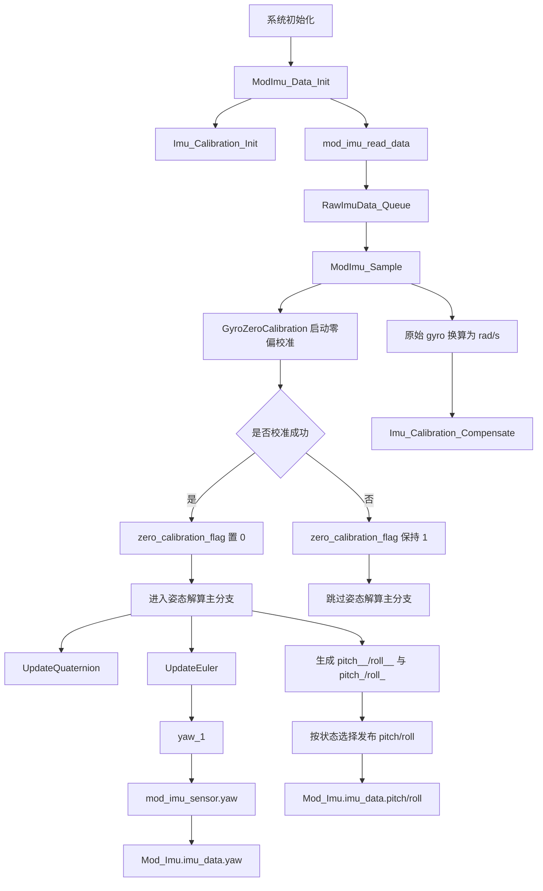

# IMU 缺少校准导致 Yaw 不更新技术链路

## 结论

当前问题不是单纯的 `yaw` 算法异常，而是 `yaw` 对外发布链路被启动零偏校准门控住了。

当 `zero_calibration_flag == 1` 时，姿态解算主分支不会执行，因此 `yaw` 不会更新。

同时，`pitch/roll` 之所以看起来还能变化，是因为它们除了姿态解算结果之外，还有一条基于加速度的备用发布链路；`yaw` 没有这条备用链路。

## 相关标志位

### 1. `zero_calibration_flag`

定义位置：APP/Device/mod_imu.c

```c
static uint8_t zero_calibration_flag = 1;
```

含义：启动阶段陀螺零偏校准是否完成。

作用：控制姿态解算主链路是否允许执行。

### 2. `calibration_done`

定义位置：APP/Device/mod_imu.c

```c
uint8_t calibration_done = 0;
```

含义：Flash 中标定参数是否有效。

作用：表示 `Imu_Calibration_Init()` 是否成功装载或兜底初始化补偿参数。

注意：这个标志不直接控制 `yaw` 是否更新。

### 3. `Mod_Imu.imu_data.calibration_status`

作用：控制 `pitch/roll` 发布时使用“加速度倾角”还是“姿态解算角”。

注意：这个标志不决定 `yaw` 解算是否执行。

## 总链路



## 关键代码链路

### 1. 初始化阶段调用 `Imu_Calibration_Init()`

```c
int ModImu_Data_Init(void) {
    ModImu_DeviceConfig();
    Queue_Init(...);
    Imu_Calibration_Init(&Imu_Calibration);
    return 0;
}
```

作用：初始化补偿参数结构 `Imu_Calibration`。

### 2. `Imu_Calibration_Init()` 的作用

```c
void Imu_Calibration_Init(ModImu_Calibration *Imu_Calibration)
```

它做两类事情：

1. 如果 Flash 标定参数有效，则装载零偏、比例系数、交叉轴系数。
2. 如果 Flash 标定参数无效，则写入兜底值：
   - `wx0/wy0/wz0 = 0`
   - `skx/sky/skz = 1`
   - 交叉轴系数全部为 `0`

它更新的是 `calibration_done`，不是 `zero_calibration_flag`。

### 3. 启动零偏校准

在 `ModImu_Sample()` 中：

```c
if (zero_calibration_flag) {
    if (GyroZeroCalibration(...)) {
        zero_calibration_flag = 0;
        update_flag = 1;
    }
}
```

这里说明：

- `zero_calibration_flag` 初始为 `1`
- 只有 `GyroZeroCalibration()` 返回成功，才会清零
- 如果一直不成功，姿态解算主链路就一直不会运行

### 4. 姿态解算主门控

```c
if (!zero_calibration_flag) {
    UpdateQuaternion(...);
    UpdateEuler(...);
    mod_imu_sensor.yaw = yaw_1 * 1000;
}
```

这段是问题核心：

- `zero_calibration_flag == 1` 时
  - `UpdateQuaternion()` 不执行
  - `UpdateEuler()` 不执行
  - `mod_imu_sensor.yaw` 不更新
- 最终 `Mod_Imu.imu_data.yaw` 只能维持旧值或默认值

### 5. `yaw` 的唯一发布链路

```c
mod_imu_sensor.yaw = yaw_1 * 1000;
Mod_Imu.imu_data.yaw = mod_imu_sensor.yaw;
```

特点：

- `yaw` 没有备用值源
- 不像 `pitch/roll` 可以退化为加速度倾角
- 只要姿态解算主分支不进，`yaw` 就不更新

## 为什么缺少 `Imu_Calibration_Init()` 会放大这个问题

`Imu_Calibration_Init()` 虽然不直接修改 `zero_calibration_flag`，但它负责保证 `Imu_Calibration` 结构体处于可用状态。

如果不调用它，会出现以下情况：

1. `Imu_Calibration` 作为全局变量会保持零初始化。
2. `Imu_Calibration_Compensate()` 中：
   - `wx0/wy0/wz0 = 0`
   - `skx/sky/skz = 0`
   - 交叉轴系数也为 `0`
3. 此时行列式为 `0`，会直接走降级分支：

```c
Imu_Calibration->wx = Wx - wx0;
Imu_Calibration->wy = Wy - wy0;
Imu_Calibration->wz = Wz - wz0;
```

也就是说，补偿模块退化为“原始角速度直通”。

这个现象本身不会直接把 `zero_calibration_flag` 改坏，但会造成两个后果：

1. 上电姿态链路缺少完整初始化，排查时容易误判为是补偿参数问题。
2. 一旦启动零偏校准迟迟不能成功，`yaw` 的唯一更新链路就会一直被门控住，表现为 `yaw` 不更新。

因此，从系统行为上看，问题表现为：

- 缺少初始化后，姿态链路准备不完整
- 启动零偏校准又是 `yaw` 解算的硬门槛
- 最终现象就是 `yaw` 不更新

## 为什么 `pitch/roll` 还能更新

`pitch/roll` 在当前实现里有两条发布链路。

### 链路 1：姿态解算结果

```c
mod_imu_sensor.roll  = -roll_ * 1000;
mod_imu_sensor.pitch = -(pitch_ * 1000);
```

### 链路 2：加速度直接计算的倾角

```c
float pitch__ = 1000 * atan2(acc_x, sqrt(acc_y * acc_y + acc_z * acc_z));
float roll__  = 1000 * -atan2(acc_y, sqrt(acc_x * acc_x + acc_z * acc_z));
```

然后根据状态决定最终发布哪一路：

```c
if (comm_soc->ctl_mr527_status.work_or_not == 1) {
    if (Mod_Imu.imu_data.calibration_status == 0) {
        mod_imu_sensor.roll  = roll__;
        mod_imu_sensor.pitch = pitch__;
    } else {
        mod_imu_sensor.roll  = -roll_ * 1000;
        mod_imu_sensor.pitch = -(pitch_ * 1000);
    }
} else {
    mod_imu_sensor.roll  = roll__;
    mod_imu_sensor.pitch = pitch__;
}
```

所以：

- `pitch/roll` 即使姿态解算链路受限，仍然可以通过加速度倾角发布
- `yaw` 无法通过加速度观测，因此没有替代链路

## 本问题的最终根因表述

### 现象

- 未完成启动校准时，`yaw` 不更新
- `pitch/roll` 仍可能变化

### 根因

- `yaw` 的发布链路完全依赖 `if (!zero_calibration_flag)` 这条姿态解算主分支
- `zero_calibration_flag` 只有 `GyroZeroCalibration()` 成功后才会从 `1` 变成 `0`
- 若启动零偏校准未完成，`yaw` 的唯一输出链路被门控住
- `pitch/roll` 由于存在加速度备用链路，所以表现为仍可更新

### 一句话总结

当前问题的本质不是 `yaw` 角计算公式本身失效，而是 `yaw` 的唯一输出链路被“启动零偏校准完成”这个条件卡住了；而 `pitch/roll` 因为有加速度备用链路，所以表象上没有一起“卡死”。
